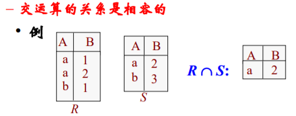

# 数据库原理-关系模型

## 基础代数运算

- 选择 (select)：从关系中选出满足条件的元组
  
- 投影 (Project)：从关系中选出若干列组成新的关系(删除重复元素)
  
- 并 (Union)：关系R和S的并：合并R和S中的元组组成新关系
  
- 差 (Diff): 注意R-S与S-R结果是不同的！
  
- 交: 关系R和S的交集
  
- 笛卡尔积：将任意两个关系的信息组合在一起
  
- 连接
  - sita-连接(sita-join): 从关系R和S的笛卡尔乘积选取属性间满足一定条件的元组。
    
  - 等值连接：sita为“=”的连接为等值连接
    
  - 自然连接：一种特殊的等值连接，必须是同名属性比较，结果中需要去掉多余同名属性
    
  - 外连接
    - 左外连接：左右关系做自然连接，取出左侧关系中所有与右侧关系的任一元组都不匹配的元组，用空值填充所有来自右侧关系的属性，再把所产生的元组加到自然连接的结果中。
        
    - 右外连接：左右关系做自然连接，取出右侧关系中所有与左侧关系的任一元组都不匹配的元组，用空值填充所有来自左侧关系的属性，再把所产生的元组加到自然连接的结果中。
        
    - 全外连接：左外连接与右外连接的并
        

## 关系模式规范形式
- 第一范式
  - 设R是一个关系模式。如果R的每个属性的值域都是不可分的简单数据项的集合，则称这个关系模式为第一范式关系模式，记作1NF。
- 第二范式
  - 若关系模式R是1NF，而且每一个**非键属性都完全函数依赖于R的候选键(码)**，则R称为第二范式关系模式，记作2NF。
- 第三范式
  - 如果关系模式R是2NF, 而且它的**任何一个非键属性都不传递地依赖于任何候选键**，则R称为第三范式关系模式，记作3NF。
- BC范式
  - 设关系模式R是1NF。如果对于R的每个函数依赖X→Y，则X必为候选键，则R是BCNF范式。
- 多值依赖与第四范式
  - 关系模式R<U，F>1NF，如果对于R的每个非平凡多值依赖X→→Y（Y  X），X都含有候选码，则R4NF
  - 4NF就是限制关系模式的属性之间不允许有非平凡且非函数依赖的多值依赖
  - 4NF所允许的非平凡多值依赖实际上是函数依赖

