# 进程和线程

## 进程
### 基本概念
进程是一个具有一定独立功能的程序在一个数据集合上的一次动态执行过程。
进程具有以下几个特点：
1. 动态性：可动态的创建,结束进程
2. 并发性：不同进程间可并发执行
3. 独立性：不同进程的执行是独立的，不会相互影响
4. 制约性：共享数据/资源或者进程间通信带来的相互制约

### 进程控制块
进程控制块是操作系统管理控制进程运行所用的信息集合。PCB是进程存在的唯一标志，每个进程在操作系统中都有唯一个PCB。
PCB中包含如下信息：
- 标识信息：进程PID
- 调度和状态信息：进程状态、CPU现场信息
- 存储管理信息：指向进程的存储空间数据结构
- 使用资源信息：使用的系统资源信息,打开文件表
- 进程间通信信息：进程间通信各种标识
- 有关数据结构连接信息：进程调度的各种队列

### 进程状态模型
**三状态模型**

### 进程切换（上下文切换）
1. 保存上下文
   - 保存寄存器信息，CPU状态信息到PCB中
2. 根据调度算法选择下一个要执行的进程
3. 回复上下文
   - 从PCB中回复进程状态
4. 交出CPU控制权

## 线程
**为什么要用线程？**
进程内的各个分支逻辑在逻辑上有先后之分，但是在具体的执行上是可以并发的执行，使用线程可以进一步提高进程的并发性。线程是进程的一部分，描述指令流执行状态。它是进程中的指令执行流的最小单元，是CPU调度的基本单位。
**线程优点**：各个线程可以并发执行，各个线程之间可以共享地址空间和文件等资源。
**线程缺点**：一个线程崩溃，会导致其所属进程的所有线程崩溃。
### 实现方式
- 用户级线程：在用户空间实现
  - 不依赖于操作系统的内核，**内核不了解用户线程的存在**，可用于不支持线程的操作系统。
  - 每个进程有私有的线程控制块（TCB）列表，TCB由线程库函数维护。
  - 同一进程内的用户线程**切换速度快**，**无需用户态/核心态切换**
  - 允许每个进程拥有自已的线程调度算法
  - 线程发起系统调用而阻塞时，则整个进程进入等待
  - **只能按进程分配CPU时间**，多个线程进程中，每个线程的时间片较少。
- 内核级线程：内核中实现
  - 线程执行系统调用而被阻塞不影响其他线程
  - 线程的创建、终止和切换相对较大，通过系统调用/内核函数，在内核实现
  - 以线程为单位进行CPU时间分配，多线程的进程可获得更多CPU时间
- 混合线程：内核中实现，支持用户线程
### 线程切换

## 线程vs进程
- 进程是资源分配单位，线程是CPU调度单位
- 进程拥有一个完整的资源平台，而线程只独享指令流执行的必要资源，如寄存器和栈
- 线程具有就绪、等待和运行三种基本状态和状态间的转换关系
- 线程能减少并发执行的时间和空间开销
- 线程的创建/终止时间比进程短
- 同一进程内的线程切换时间比进程短
- 由于同一进程的各线程间共享内存和文件资源，可不通过内核进行直接通信。

