# 存储管理

存储管理的作用：
1. **抽象**逻辑地址空间
2. **保护**独立地址空间
3. **共享**访问相同内存
4. **虚拟**出更大的空间

## 存储体系

其中MMU负责逻辑地址和物理地址之间的转换。
## 地址空间
- **物理地址空间**：硬件（内存）支持的空间
- **逻辑地址空间**：CPU运行的进程看到的空间
### 逻辑地址的生成
1. 编译器提前生成
   - 提前知道起始地址
   - 起始地址改变，重新编译
2. MMU生成
   - 在执行时生成
### 逻辑地址检查

## 物理内存管理
### 连续内存分配
给进程分配一块不小于指定大小的连续的物理内存区域
- 内存碎片
  - 外部碎片：分配单元之间的未被使用内存
  - 内部碎片：分配单元内部的未被使用内存
  - 碎片整理：
    - 碎片紧凑：通过移动分配给进程的内存分区，以合并外部碎片
    - 分区对换：通过抢占并回收处于等待状态进程的分区，以增大可用内存空间
- 固定分区分配：每个分区固定大小
- 动态分区分配：分区大小可变
  - 最先匹配：使用第一个可用的空间比n大的空闲块
  - 最佳匹配：查找并使用不小于n的最小空闲分区
  - 最差匹配：使用尺寸不小于n的最大空闲分区
**连续内存分配的缺点？**
1. 内存空间利用率低
2. 无法动态修改
3. 无法共享代码和数据
### 非连续内存分配
**为什么要非连续分配？**
1. 可以提高内存利用率
2. 可以共享代码和数据
3. 可以动态链接和动态加载

### 段式存储管理
程序可根据逻辑划分成若干代码段
- 段表示访问方式和存储数据等属性相同的一段地址空间
- 段对应内存中的一段连续空间

### 页式存储管理
- 页帧：**物理地址空间**划分为大小相同的基本分配单位，大小为2的n次方
- 页面：**逻辑地址空间**也划分为相同大小的基本分配单位，页面和页帧大小相同

**页式管理的性能问题**
- 访问一个内存单元需要2次内存访问（1访问页表；2访问数据）
  - 解决办法：缓存（块表，TLB）
- 页表可能很大
  - 解决办法：多级页表,返置页表

- TLB 使用关联存储(associative memory)实现，具备快速访问性能，可以并行查找。
- TLB命中，直接获得物理页帧号
- TLB未命中，查页表,并更新到TLB中

- 一般情况下,程序并不会使用到所有的页面,那么使用多级页面可以节省空间.

反转页表的思路是从物理地址空间出发，系统建立一张页表,页表项记录进程i的某虚拟地址(虚页号)与页框号的映射关系.
反转页表需要解决hash冲突,常见的方式是拉链法,线性探查法.
## 段页式管理
段式存储在内存保护方面有优势，页式存储在内存利用率和优化转移到后备存储方面有优势.

通过指向相同的页表基址，可实现进程间的段共享

## 虚拟存储
内存空间不够，想在有限的内存空间内运行更多的程序。
虚拟存储的解决思路是将部分进程/进程的一部分放在内存中，进程可在内存和外存中互换。
- 虚拟存储的理论依据是**局部性原理**：
  1. 时间局部性：一条指令的执行和下次执行，一个数据的访问和下次访问，都集中在较短的时间内。
  2. 空间局部性：当前指令和之后要执行的指令，当前访问的数据和之后要访问的数据，通常在相邻的一段区域内。
  3. 分支局部性：一条跳转指令的两次执行，很可能在相同的内存位置。

- 具体的实现思路
  1. 加载程序时只将当前指令需要的页面或段加载到内存。
  2. 执行过程中发现要访问页面/段不在内存，由操作系统将响应的页面/段调入内存。
  3. 操作系统将暂时不用的页面/段转移到外存。

### 虚拟页式存储管理
在页式存储管理的基础上，增加请求调页和页面置换

缺页异常的处理

在将外存中的页面换入内存中，需要做如下检查：
1. 在内存中有空闲物理页面时，分配一物理页帧f，转第5步；
2. 依据页面置换算法选择将被替换的物理页帧f，对应逻辑页q
3. 如q被修改过，则把它写回外存；
4. 修改q的页表项中驻留位置为0；
5. 将需要访问的页p装入到物理页面f
6. 修改p的页表项驻留位为1,物理页帧号为f；
7. 重新执行产生缺页的指令

### 页面置换算法
调入页面到物理内存时，物理内存满了，需要将当前内存中的一个页面换出到外存。如何选择这个换出的页面就是页面置换算法。

#### 最佳置换算法
置换将来最长时间不会被访问的页面。
**优点**：最佳，作为其他算法评测依据
**缺点**：没法实现，无法预知未来
#### 先进先出算法（FIFO）
最先进入内存的页面最先被换出
**优点**：实现简单
**缺点**：最先进入又可能时最经常使用的;会出现belady现象（物理页面增多，反而置换次数增加）
#### 第二次机会算法
在先进先出算法基础上，检查被选出的页面的访问位，如果为0，置换出去；如果为1，将访问为置0，并插入到队列末尾。
**优点**：实现简单，在FIFO基础上考虑到经常访问的页面
**缺点**：首部摘链和尾部加链需要额外开销。
#### 最近最久不使用算法（LRU）
选择最长时间没被访问的页面置换
**优点**：性能接近最优算法
**缺点**：实现复杂，开销大（需要线性扫描所有的页框）
#### 最低使用频率算法（NFU）
使用计数器记录访问次数，选择访问次数最低的页面进行置换
**优点**：想比于LRU实现相对简单，开销小。
**缺点**：性能和LRU有差距
#### 时钟算法
移动指针在环形链表中扫描，优先找到没有被访问（访问位0），没有被修改（修改位0）的页面替换。
**优点**：开销小
**缺点**：性能较低
#### 老化算法
每个页面维护一个计数器，每次时钟中断时，计数器先右移，在最左端加R位的值。可以看到随着时间的推移，如果页面经常访问，那么计数器会相对更大。每次选择计数器最小的置换。
**优点**：比NFU,老化算法考虑到时间的因素,即越早的访问对当前的选择影响越低,越近的访问影响越高.
**缺点**：性能和LRU有差距
#### 工作集算法
**优点**
**缺点**

