# 存储管理

存储管理的作用：
1. **抽象**逻辑地址空间
2. **保护**独立地址空间
3. **共享**访问相同内存
4. **虚拟**出更大的空间

## 存储体系

其中MMU负责逻辑地址和物理地址之间的转换。
## 地址空间
- **物理地址空间**：硬件（内存）支持的空间
- **逻辑地址空间**：CPU运行的进程看到的空间
### 逻辑地址的生成
1. 编译器提前生成
   - 提前知道起始地址
   - 起始地址改变，重新编译
2. MMU生成
   - 在执行时生成
### 逻辑地址检查

## 物理内存管理
### 连续内存分配
给进程分配一块不小于指定大小的连续的物理内存区域
- 内存碎片
  - 外部碎片：分配单元之间的未被使用内存
  - 内部碎片：分配单元内部的未被使用内存
  - 碎片整理：
    - 碎片紧凑：通过移动分配给进程的内存分区，以合并外部碎片
    - 分区对换：通过抢占并回收处于等待状态进程的分区，以增大可用内存空间
- 固定分区分配：每个分区固定大小
- 动态分区分配：分区大小可变
  - 最先匹配：使用第一个可用的空间比n大的空闲块
  - 最佳匹配：查找并使用不小于n的最小空闲分区
  - 最差匹配：使用尺寸不小于n的最大空闲分区
**连续内存分配的缺点？**
1. 内存空间利用率低
2. 无法动态修改
3. 无法共享代码和数据
### 非连续内存分配
**为什么要非连续分配？**
1. 可以提高内存利用率
2. 可以共享代码和数据
3. 可以动态链接和动态加载

### 段式存储管理
程序可根据逻辑划分成若干代码段
- 段表示访问方式和存储数据等属性相同的一段地址空间
- 段对应内存中的一段连续空间

### 页式存储管理
- 页帧：**物理地址空间**划分为大小相同的基本分配单位，大小为2的n次方
- 页面：**逻辑地址空间**也划分为相同大小的基本分配单位，页面和页帧大小相同

**页式管理的性能问题**
- 访问一个内存单元需要2次内存访问（1访问页表；2访问数据）
  - 解决办法：缓存（块表，TLB）
- 页表可能很大
  - 解决办法：多级页表,返置页表

- TLB 使用关联存储(associative memory)实现，具备快速访问性能，可以并行查找。
- TLB命中，直接获得物理页帧号
- TLB未命中，查页表,并更新到TLB中

- 一般情况下,程序并不会使用到所有的页面,那么使用多级页面可以节省空间.

反转页表的思路是从物理地址空间出发，系统建立一张页表,页表项记录进程i的某虚拟地址(虚页号)与页框号的映射关系.
反转页表需要解决hash冲突,常见的方式是拉链法,线性探查法.
## 段页式管理
段式存储在内存保护方面有优势，页式存储在内存利用率和优化转移到后备存储方面有优势.

通过指向相同的页表基址，可实现进程间的段共享

## 虚拟存储
内存空间不够

