# FabricOnK8s

k8s 部署 fabric 集群 

## 是什么
基于k8s的自动化部署和测试工具，功能是自动化启动fabric集群，自动化部署安装智能合约，自动化测试合约。
## 为什么
1. fabric的使用比较复杂，部署和调试也比较麻烦和耗时。作为开发人员，希望更多的把精力放在合约的开发，而不是
把大量的时间花费在部署和调试网络上。使用了自动化的工具后，一方面可以节约时间，另一方面可以提高开发效率。
2. fabric官方没有提供能让我再多台物理机上部署fabric网络的工具，所以得自己解决。
## 怎么做

### 1.前置准备
- 提前用kubeadm搭建好k8s集群(1台master节点，4台worker节点)
  - master节点初始化：kubeadm init --pod-network-cidr=10.244.0.0/16 --apiserver-advertise-address=10.10.11.11 --kubernetes-version v1.13.1
  - worker节点加入：kubeadm join 10.10.11.11:6443 --token 9hwfqp.gkw63rw4yp4kowjb --discovery-token-ca-cert-hash 
  - 配置flannel网络，使得各个pod之间才能通信
- NFS server在5个节点间共享目录/opt/share/
  - mount -t nfs 10.10.11.31:/opt/share /opt/share
### 2.实现
- 命令行接口
  - python实现，-f 指定初始系统配置文件system.conf
  - system.conf 包括worker节点ip信息，网络规模（组织数，每个组织节点规模），测试任务配置，智能合约配置
- 配置解析模块
  - ConfigParser模块读取/解析配置文件
  - config 配置文件由两部分组成sections与items 。sections 用来区分不同的配置块。items 是sections下面的键值
- fabric配置生成
  - 根据网络规模生成crypto-config.yaml配置文件，根据该配置生成所有的密码材料（证书，私钥），并将其拷贝到NFS的共享目录
  - 生成区块链网络的配置文件config.tx，用于启动区块链网络
- k8s配置生成
  - 根据k8s的模板文件生成目标用于部署的文件。
  - 模板的替换使用python的 string template模块，用于替换$开头的指定字符串。
  - 模板文件包含namespace模板，pv和pvc模板，各类pod和service模板。
    - namespace模板定义每个组织的命名空间，和组织名相同
    - pv模板定义每个组织的持久化存储，使用的是nfs的共享目录
    - pvc模板定义每个组织的持久化存储声明
    - peer模板定义每个peer节点的pod和service
      - pod需要通过nodeSelector指定部署节点，以及挂载的pvc
      - service需要指定开放的端口，使用nodePort模式
- caliper配置生成
  - 生成区块链网络的连接配置文件fabric-go.json,用于连接fabric网络。
  - 此处用到docker模块，用于查询每个worker上运行的fabric容器。
  - 根据测试配置模板生成对应的测试配置，用于确定测试的轮数以及tps。
- 节点和网络启动
  - shell实现，kubectl create -f 将节点启动
- caliper启动运行
  - shell实现
  - 测试用例生成代码提前写好的，根据操作和数据的不同，随机生成的数据。
- 退出网络
  - shell实现，退出网络 kubectl delete -f 
  - 删除生成的所有配置文件
## 结果
- 实现了fabric网络的多机部署。
- 部署启动网络到测试代码生成测试报告的时间大大缩短。
- 可以自定义不同网络规格下的连续测试任务，不需要人为操作。
## 成长

## Q&A

1. 为什么用K8s而不用swarm
    k8s和docker松耦合的，可以自己定制服务。
    swarm和docker高度耦合，如果docker API不支持的事你就没法做。
    网络配置和持续化存储卷
2. 存储扩展