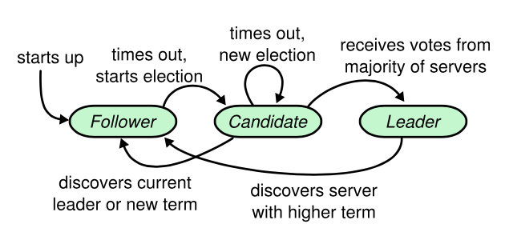

# 基于raft共识算法的kv存储

## 是什么

基于raft共识算法的kv存储服务，提供GET/PUT/APPEND操作

## 为什么

- raft是目前应用比较广泛的共识算法，也相对易于理解和实现，从这个点切入去了解共识算法是一个合理的选择。
- fabric当前使用raft算法来做共识，项目需要去实现自己的共识算法，需要熟悉raft共识算法，熟悉最好的办法就是自己实现。

## 怎么做

### raft共识算法实现

raft算法包含leader选举，日志复制，存储快照

#### leader的选举

**leader选举基本流程**

1. 所有节点以follower启动
2. follower的选举时钟超时，转为candidate
   1. 将term加1
   2. 给自己投票
3. candidate向其他节点发送投票请求，如果收到过半节点的投票，则成为leader
   1. 如果没有选出leader，candidate重新进入candidate状态，开启新的一轮选举
4. leader周期性向其他节点发送心跳包以维持权威

**重置选举时钟**
重置选举时钟的3种情形：
1. 从leader处收到appendentriesRPC调用（如果leader的term过期则不用重置）
2. 开始新的一轮选举
3. 给其他节点投票（收到requestVoteRPC调用）

**关于逻辑时钟term**
1. 任何状态下的节点只要发现更高的term都要转为follwer,同时将term更新为最新
2. 对于过期term的消息不予处理。

**什么样的日志是最新的？**
1. term大为最新
2. term相同，log长的为最新的

#### 日志的复制
- 基本流程
  1. Leader 收到 client 发送的 request。
  2. Leader 将 request append 到自己的 log。
  3. Leader 将对应的 log entry 发送给其他的 follower。
  4. Leader 等待 follower 的结果，如果大多数节点提交了这个 log，则 apply。
  5. Leader 将结果返回给 client。
  6. Leader 继续处理下一次 request。

leader中维护了两个列表nextindex和matchindex来协助日志的复制。
nextindex维护了对于需要发送给每个follower的下一个日志条目的索引值（初始化为领导人最后索引值加一）
matchindex维护了于每个follwer已经复制的日志的最高索引值。

**日志冲突处理**
日志冲突指指定index的元素的term不一致。论文中日志冲突follower只会返回失败，而不是具体的冲突信息。leader对于冲突的处理也是简单的线性递减探查，此种办法效率低下。经过优化后：
1. follower: 定位冲突信息（conflictTerm、conflictIndex），并将其返回给leader。其中conflictTerm是follwer的冲突term，conflictIndex是该conflictTerm下的第一个元素。
2. leader: 根据conflictTerm、conflictIndex，找到在log中conflictTerm的最后一个元素。并将nextindex设置为该值。

**提交状态机**

- 一个守护线程，批量处理需要提交的元素

### kv存储实现

**client**

- 需要客户端id和随机消息id来区分每一条seq，其中消息id递增，防止重复消息
- 发现请求的不是leader需要及时切换leader

**server**

- 需要记录已经提交到状态机每个client的最新序列号的seq，任何小于seq的消息都不予处理。
- 需要一个channel map 来获取每个操作对应的返回结果
- client所有请求操作通过调用raft接口，利用raft模块做共识。在提交之前需要设置好对应的消息传递channel，之后等待返回消息。
  - 此处需要用select来同时等待消息以及等待时钟的信号
- server会有一个守护线程，接受raft模块提交的操作，并根据相应的操作执行kvDB的操作。并将相应的操作结果通过channel返回给接收端
- 将处理结果返回给client

### 工程优化

#### 日志复制优化
- pipeline优化和流量控制机制
  - 优化点
    - Leader收到某个follower的AppendEntryResponse之前，不再给它发送任何AppendEntry。由于等待响应的时间取决于网络的TTL，这在实际应用中是非常低效的。
  - 具体实现思路
    - 引入 pipeline 优化，以及配套的流量控制机制来避免“优化”带来的网络拥塞。
    - pipline优化
      - 流水线式的发送appendentry消息，而不等待相应的response。
      - 如果之前某个appendentry消息的相应是失败，那么需要调整nextindex，并重新发送appendentry流水消息
    - 防止网络拥塞
      - 使用类似滑动窗口机制来控制发送的消息数量
      - 滑动窗口表示了所有leader以发出，但是follower没有响应的消息
      - 滑动窗口会根据follower的响应来进行滑动调整
      - 滑动窗口的大小是有上限的，最小在以提交的日志条目后，最大在leader日志的最后一个。
- batch批量处理
  - 优化点
    - 日志复制的过程中主要的时间消耗在网络传输以及日志写磁盘上，原始版本是一个entry为单位的复制到follower，批处理batch可以有效的减少磁盘IO次数以及网络通信次数。
  - 具体实现思路
    - 定义变量batchsize表示最大的batch entry上限。
    - 每次appendEntry时附带batch过的entry数组去复制。
- 并行复制
  - 优化点
    - leader自己append log和给follower发appendentry消息是不冲突的，这两部分可以并行做。且因为append log涉及磁盘IO操作。
  - 具体实现思路
    - leader接收到client请求便可以同时开始本地append log以及follower发appendentry消息
    - 只要超过半数的节点append便可以commit
    - 注意，follower必须append log到磁盘才能回复leader成功的消息
#### kv读操作优化
- readindex
  - 优化点
    - read操作走raft流程固然能确保线性一致性，但是性能是十分低效的。
  - 具体实现
    - leader维护一个readIndex，将当前自己的 commitIndex 记录到ReadIndex 里面。
    - 向其他节点发起一次 heartbeat，确保现在自己仍然是 leader。
    - Leader 等待自己的状态机执行，直到 applyIndex>=ReadIndex，这样就能够安全的提供 linearizable read 了。
    - Leader 执行 read 请求，将结果返回给 client。
  - 存在的问题
    - 仍然需要网络通信开销，即heartbeat过程
- lease read机制
  - 优化点
    - read操作走raft流程固然能确保线性一致性，但是性能是十分低效的。
    - readIndex方法中的heartbeat网络开销也不容忽视。
  - 具体实现思路
    - readIndex方法使用的heartbeat来确保自己仍然是leader，这里采用lease租约机制来确认leader身份
    - lease的计算根据每次heartbeat的时间点，结合选举时钟election timeout 来得出的
    - leader在lease租期内自动确认为leader，等到applyIndex>=ReadIndex就可以返回值给客户端
    - lease过期的话可使用readIndex机制
  - 存在的问题
    - 如果节点的CPU时钟走的不一致，可能会导致lease机制出问题，一般在lease
- follower read机制
  - 优化点
    - leader既要复制日志复制，又要处理大量的读请求，这样在**高并发**的场景下leader的压力会非常大。通过follower来分担leader的读压力，会有效的提高系统的可用性。
    - follower只处理复制日志，和选举投票，显得有些浪费资源。
  - 具体实现
    - 与readIndex机制类似
    - 客户端对Follower 发起读请求的时候，Follower会请求此时 Leader 的 CommitIndex
    - Follower拿到 Leader 的最新的 CommitIndex 后，等本地 Apply Index 达到Leader最新的CommitIndex后，将这条数据返回给客户端
  - 存在的问题
    - 有可能存在数据不一致的情形：leader的apply速度没有follower的快，导致从follower处读的值和leader的不同。

#### 可扩展性优化
- multi raft group
  - 优化点
    - 一个raft集群的存储容量是有上限的，过多增加raft集群节点规模会导致性能下降，因此采用多raft集群（multi raft）来实现水平扩展的目的。
    - 一个raft集群能够承受的并发量也是有限的，多个集群能够做到性能的水平扩展
  - 具体实现
    - 数据分片（sharding）：将数据进行分片处理，让每个Raft集群单独负责一个region。数据分片的方式一般分为range和hash，这里主要采用range的方式
      - range法
        - 假设key都是可排序的，将一段连续的key作为分片单元
        - 优点：支持范围查询，易扩展（分裂和合并容易）
        - 缺点：对顺序写（如log追加）不友好，压力一直在最后一个region
      - hash法
        - 将key经过一个Hash函数计算，用得到的值来决定Sharding ID
        - 优点：key分布更均匀，对于写压力比较大、同时读基本上是随机读更加友好
        - 缺点：不支持范围扫描，不易扩展（re-hash的代价很高昂）
    - 
## 结果
实现了功能

## 成长
熟悉raft共识算法，对分布式系统有了更多的了解, 深刻认识到分布式系统开发的复杂性,培养了能够从无到有实现系统的能力。

## Q&A

leader负载均衡

高并发处理

存储扩展

工程上的优化

分片

## 需要加强的点

1. raft的工程优化(etcd, Consul  raft)
   譬如 pre-vote，check quorum 机制，batch 以及 pipeline。

2. 工业级的kv存储实现做法（tikv）
   Tikv源码阅读解析
   multiple raft group